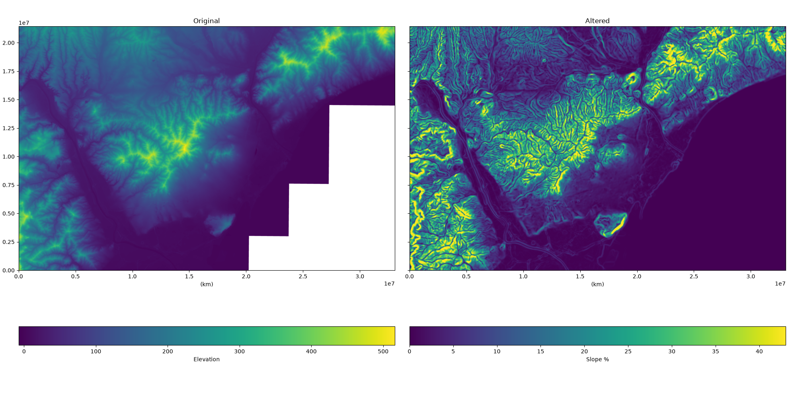
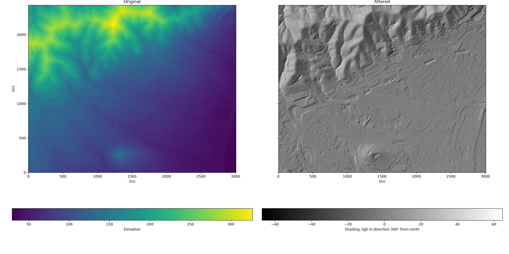
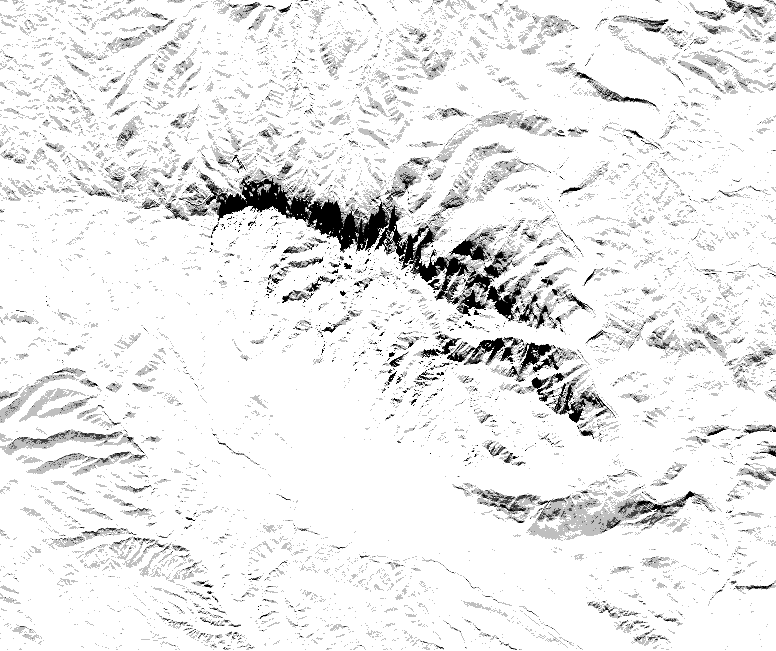
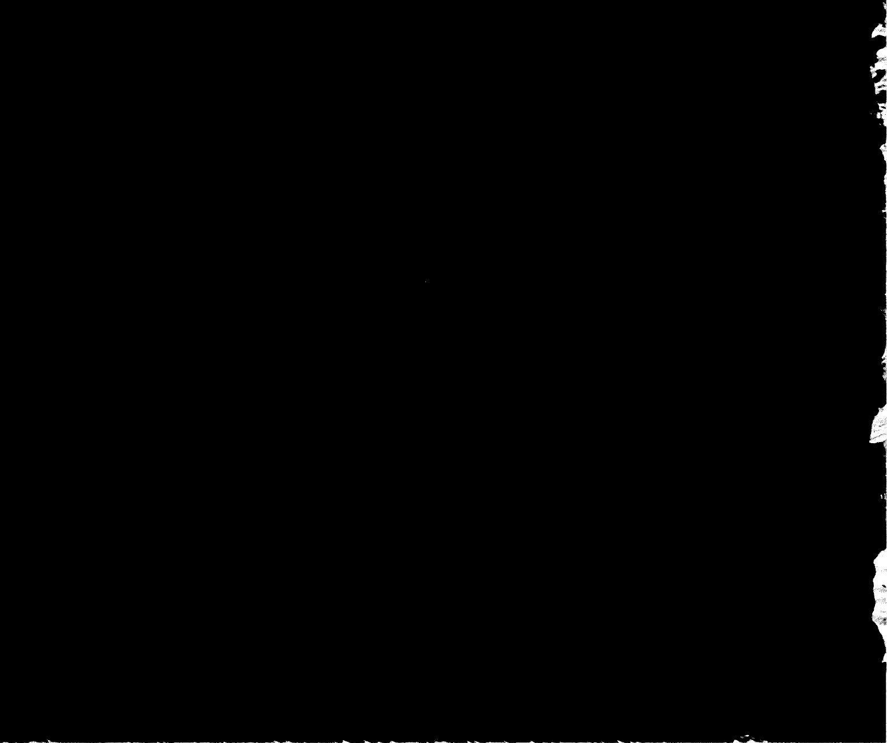
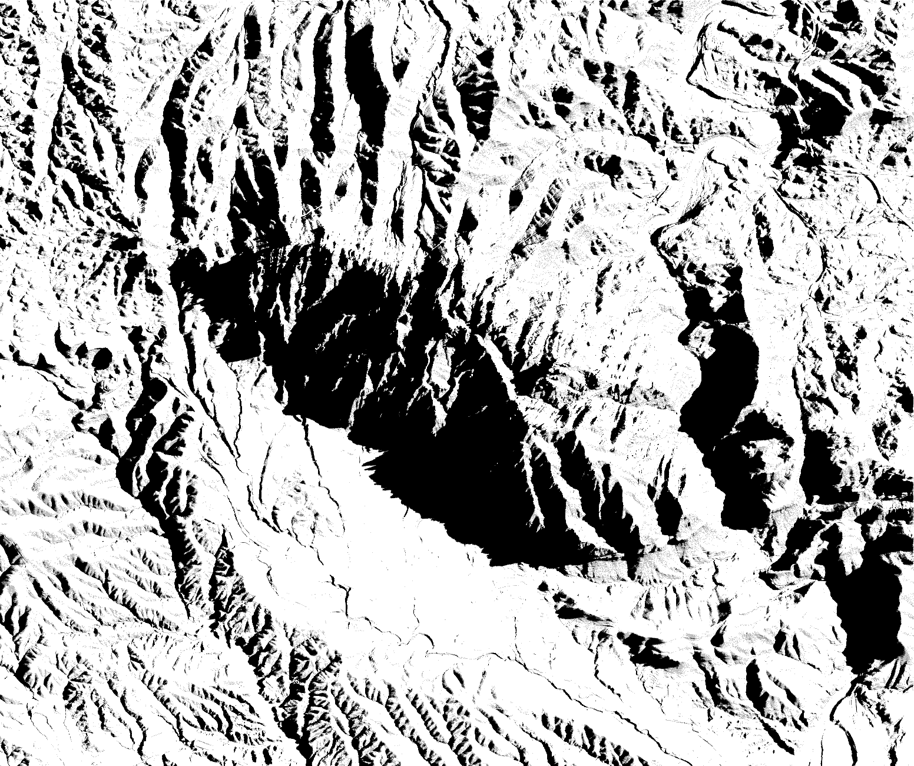

# Elevation data visualizer

## Getting started

Get your environment ready by running:
```sh
make dependencies
```
This will download dependencies and build the binaries.

## How to use
First, download data from https://visors.icgc.cat/appdownloads/. It must be elevation data in TIF format.

Unzip the download and put it in some directory, for example `data/barcelona` and unzip it.

Create a config file:
```yaml
data-directory: data/barcelona # Where your elevation data is
output-directory: out          # Where the outputs will go to
downsample: 4                  # Ratio to lower resolution. Default 1.
style: shading                 # Style of generated image, see below
style-args:                    # Args for the style, see below
  angle: 180
```

Then run it with: 
```sh
make run
```

## Styles

### Slope
Style `slope` shades terrain based on how inclined it is (i.e. the norm of the gradient).

Here is an example with 2m-resolution data around Barcelona.


Blank areas are outside the source map (in this case it's just the sea).


### Shading
Style `shading` colors the terrain according to the slope in a particular direction. Slopes facing towards this direction will be brighter, and slopes facing against it will be darker.

The direction is expressed as an angle in style-arg `angle`. 0° is north (so shadows go south), 90° is east, and so on until 360° which is north again.

Note: there is no ray-tracing, the image is shaded based exclusively on the direction the ground points towards.

Here is an example with 25cm lidar data around North Barcelona lit from the north west


### Sunshine and animation
Style `sunshine-static` renders shadows for a fixed sun position. You can define the position either by explicit solar angles, or by an ISO 8601 timestamp and the script will compute the corresponding Sun position from the data's location and time.

The direct angle-based form uses:
- `sun-azimuth`: azimuth in degrees clockwise from north
- `sun-altitude`: elevation above the horizon in degrees

The date/time form uses:
- `datetime`: a timezone-aware ISO 8601 timestamp such as `2026-01-08T12:00:00+02:00`

Style `sunshine-animation` creates a GIF by interpolating between the start and end solar conditions. Use either:
- `datetime-start` and `datetime-end`, or
- `sun-azimuth-start` and `sun-altitude-start` together with `sun-azimuth-end` and `sun-altitude-end`

Both sunshine styles accept `subsampling-level`:
- `0` casts one ray from each pixel center (no subsampling)
- `1` casts four offset rays per pixel
- `2` casts four offset rays per pixel, with each ray's position randomly jiggled. Useful to avoid sudden jumps in animations.

Example static render using a real timestamp:
```yaml
style: sunshine-static
style-args:
  datetime: 2026-01-08T12:00:00+02:00
  subsampling-level: 2
```

Example animation using timezone-aware datetimes:
```yaml
style: sunshine-animation
style-args:
  datetime-start: 2026-01-08T12:00:00+02:00
  datetime-end: 2026-01-08T19:00:00+02:00
  frames: 120
  duration: 5
  subsampling-level: 1
```

If you prefer explicit angles instead of datetimes, this equivalent form also works:
```yaml
style: sunshine-static
style-args:
  sun-azimuth: 250
  sun-altitude: 45
  subsampling-level: 1
```

Run the usual command to save the output in the configured output directory.

Example sunset animation over Montserrat, with angles chosen to make it look good.


By using actual timestamps rather than azimuth/alitude angles, you can generate real sunsets.

This GIF compares 08:00-19:00 for a random day in January and one in June. See the much longer winter shadows!

| January 2026 | June 2026 |
|---|---|
|  |  |